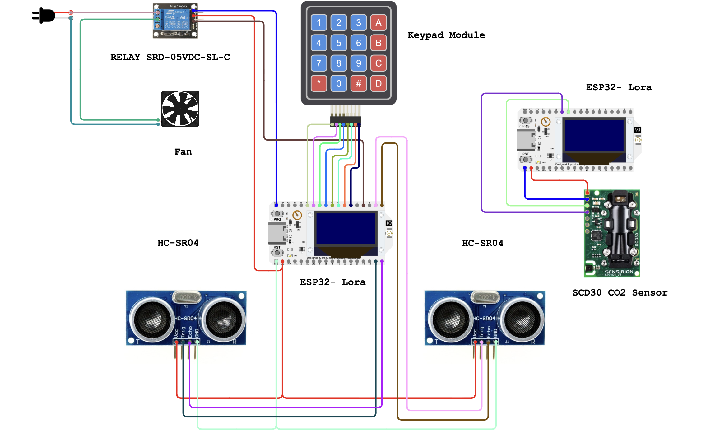

# CO2 Monitoring and Ventilation System

### ELEC70126 IoT Project

A room-level CO2 monitoring system that tracks indoor air quality, occupancy, and weather conditions, and provides automated ventilation recommendations and fan control via a live web dashboard. The app also allows users to track their focus levels and better understand how their concentration is affected by CO2 levels.

---

## Repository Structure

```
.
├── Firmware/
│   ├── secrets.h               # Shared WiFi and ThingSpeak credentials (not tracked)
│   ├── indoor_node_1/          # SCD30 CO2/temperature/humidity sensor node
│   └── indoor_node_2/          # People counter, concentration keypad, fan control node
│
├── ThingSpeakCode/
│   ├── weather_api_script.m    # Fetches outdoor weather and writes to ThingSpeak
│   ├── fan_control_script.m    # Automated fan control logic (runs on ThingSpeak)
│   └── secrets.m               # ThingSpeak channel IDs and keys (not tracked)
│
├── app/
│   ├── config.py               # Channel config, data fetching, CSS
│   ├── Live_Monitor.py         # Main dashboard (Monitor, Time Series, Analytics)
│   └── requirements.txt        # Python dependencies
│
├── Data/                       # Exported CSV datasets from ThingSpeak channels
└── analysis.ipynb              # Offline data analysis notebook and digital signal processing 
```

---

## Circuit Diagram



---

## Firmware

Both nodes run on ESP32 boards and communicate with ThingSpeak via MQTT. Credentials are stored in `Firmware/secrets.h` and included by both sketches.

### Node 1: Indoor Sensor (`indoor_node_1`)

Reads CO2 concentration, temperature, and relative humidity from a Sensirion SCD30 sensor every 15 seconds and publishes to ThingSpeak.

### Node 2: People Counter,  Fan Control and Keypad (`indoor_node_2`)

- Counts occupants entering and leaving the room using two ultrasonic sensors in a beam-break configuration
- Accepts a self-reported concentration rating (1-10) via a 4x4 keypad
- Subscribes to a fan command channel and toggles a fan relay via GPIO
- Publishes occupant count and concentration rating to ThingSpeak

---

## ThingSpeak Scripts

These MATLAB scripts run as scheduled ThingSpeak React/TimeControl tasks.

**`weather_api_script.m`** fetches current outdoor temperature and humidity from the Open-Meteo API (set to the project location) and writes them to a ThingSpeak channel every 15 minutes.

**`fan_control_script.m`** reads the latest CO2 level, outdoor temperature, and window status, then writes a fan on/off command. Although opening the window is the most effective way to ventilate the room, the fan activates when CO2 exceeds 1000 ppm to try and mix the air, or when a window has been opened in the last 15 minutes to help speed up air circulation.

---

## Dashboard App

Built with Streamlit. Run locally with:

```bash
cd app
pip install -r requirements.txt
streamlit run Live_Monitor.py
```

The dashboard has three tabs:

- **Monitor:** live CO2 reading, indoor/outdoor conditions, occupancy, and a ventilation recommendation based on configurable thresholds
- **Time Series:**  interactive plots of any combination of sensor channels over a selected date range
- **Analytics**: Average CO2 by hour of day, time spent in each CO2 band, focus score analysis, and ventilation response statistics

Data is fetched directly from ThingSpeak and cached for 30 seconds (live view) or 10 minutes (historical).

---

## Data

The `Data/` folder contains CSV exports of all ThingSpeak channels collected during the study period. These are used by `analysis.ipynb` for offline analysis.

| File                                   | Contents                            |
| -------------------------------------- | ----------------------------------- |
| `scd30_sensor_readings.csv`          | Indoor CO2, temperature, humidity   |
| `weather_api_readings.csv`           | Outdoor temperature and humidity    |
| `occupancy_detection_readings.csv`   | People count                        |
| `logged_concerntration_readings.csv` | Self-reported concentration ratings |
| `logged_window_status_history.csv`   | Window open/closed events           |
| `fan_control_history.csv`            | Fan command history                 |

---

## Secrets

`Firmware/secrets.h` and `ThingSpeakCode/secrets.m` are not committed to version control. Templates:

**`Firmware/secrets.h`**

```c
#define WIFI_SSID            "your_ssid"
#define WIFI_PASSWORD        "your_password"
#define TS_MQTT_CLIENT       "your_client_id"
#define TS_MQTT_USER         "your_mqtt_user"
#define TS_MQTT_PASS         "your_mqtt_pass"
#define TS_CHANNEL_ID_NODE1  0000000
#define TS_CHANNEL_ID_NODE2  0000000
#define TS_FAN_CHANNEL_ID    0000000
```

**`ThingSpeakCode/secrets.m`**

```matlab
channelA_ID = 0000000;   readKeyA = 'your_key';
channelB_ID = 0000000;   readKeyB = 'your_key';
channelC_ID = 0000000;   writeKeyC = 'your_key';
channelD_ID = 0000000;   readKeyD = 'your_key';
weatherChannelID = 0000000; weatherWriteKey = 'your_key';
```
